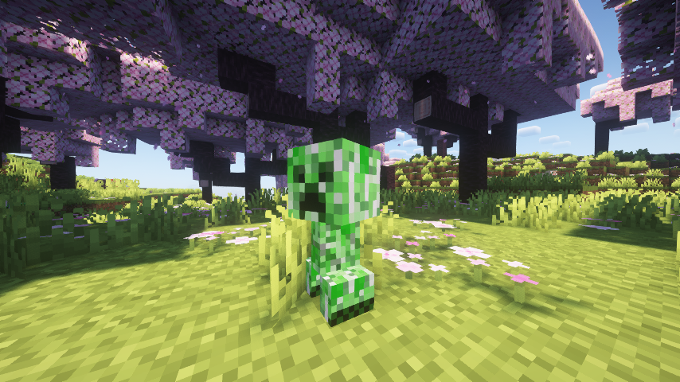
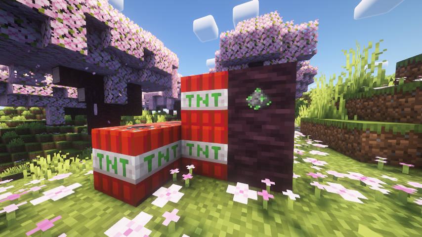

<strong>Features</strong>

<ul>
<li>The <i>Creeplet</i> hostile mob! This new mob is a smaller, faster, and less explosive version of the Creeper.</li>
<li>The Creeplet will spawn in groups of 2 to 3, anywhere the Creeper spawns.</li>
<li>Drops <i>Unstable Gunpowder</i> when killed.</li>
<li>The Unstable Gunpowder is used to craft the new <i>Unstable TNT</i> block.</li>
<li>The Unstable TNT explodes faster and more variable than TNT.</li>
</ul>

<strong>Installation</strong>

<ul>
<li>Install the <a href="https://fabricmc.net/">Fabric Loader</a>.</li>
<li>Download <a href="https://modrinth.com/mod/fabric-api">Fabric API</a> & <a href="https://modrinth.com/mod/cloth-config">Cloth Config</a>.</li>
<li><a href="https://modrinth.com/mod/creeplets/versions">Download Creeplets</a>.</li>
<li>Put all three mods into your <i>mods</i> folder.</li>
</ul>

<strong>Configuration</strong>

 
Each attribute of the Creeplet and Unstable TNT can be configured. The config can be accessed with Mod Menu or in your <i>config</i> folder.
<pre>
{
  // The time it takes for the Creeplet to explode. Default for vanilla Creeper is '30'.
  "fuseTime": 10,
  // The size of the explosion. Default for vanilla Creeper is '3'.
  "explosionRadius": 2,
  // How fast the Creeplet moves. Default for vanilla Creeper is '0.25'.
  "movementSpeed": 0.5,
  // The maximum health of the Creeplet. Default for vanilla Creeper is '20'.
  "maxHealth": 10.0,
  // The time it takes for the Unstable TNT to explode. Default for vanilla TNT is '80'.
  "tntFuseTime": 10,
  // The minimum power of the Unstable TNT. Vanilla TNT explodes at a power of '4'.
  "tntMinPower": 2.0,
  // The maximum power of the Unstable TNT. Vanilla TNT explodes at a power of '4'.
  "tntMaxPower": 10.0
}
</pre>

<strong>The Creeplet!</strong>

<strong>The Unstable TNT & Unstable Gunpowder!</strong>

